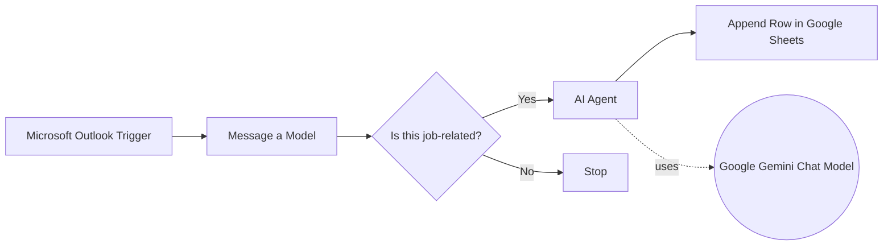

## Workflow Diagram

## Project Purpose
This workflow was created to demonstrate how AI can automate and optimize real business operations. Instead of manually tracking job applications or incoming interest, the system uses a combination of email triggers, LLM processing, and structured logging to create a reliable, scalable tracking pipeline.  
The goal is to reduce repetitive work, ensure consistent data capture, and allow individuals and teams to make better follow-up decisions based on clean, structured information.

This reflects a core belief: **AI is most valuable when it enhances how people work and does not replace them.**
